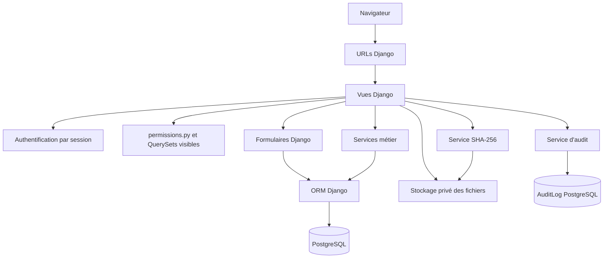
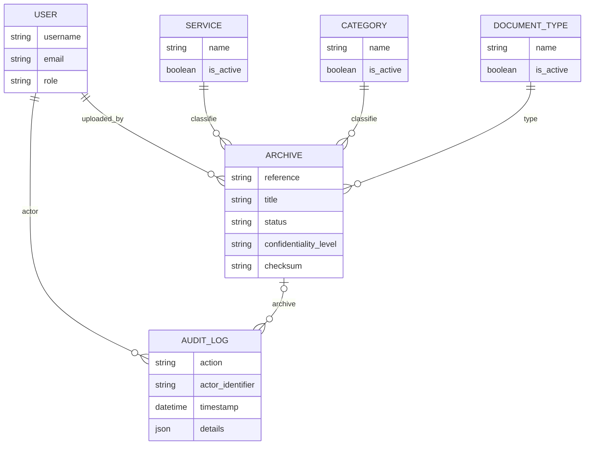

# Architecture finale du MVP

## Vue d’ensemble

C-Tech Archives est un **monolithe modulaire Django rendu côté serveur**. Le navigateur reçoit des pages Django Templates ; les vues appliquent l’authentification et l’autorisation, délèguent la validation aux formulaires et services, puis utilisent l’ORM avec PostgreSQL. Les documents binaires ne sont pas servis par une URL publique : ils sont conservés dans un stockage privé et diffusés seulement par une vue autorisée.

## Chemin d’une requête

| Étape | Responsabilité | Composants réels |
|---|---|---|
| 1. Navigation | Reçoit une URL et associe une route à une vue | `config.urls`, `accounts.urls`, `archives.urls`, `audit.urls`, `dashboard.urls` |
| 2. Identité | Établit la session et vérifie le compte | Auth Django, `accounts.User`, `LoginView`, `LogoutView` |
| 3. Autorisation | Détermine le périmètre et les actions autorisées | `archives.permissions`, mixins `archives.access`, politiques de contexte |
| 4. Validation | Contrôle la saisie et les fichiers | `ArchiveForm`, `ArchiveSearchForm`, CSRF Django |
| 5. Persistance | Lit et écrit les métadonnées relationnelles | ORM Django et PostgreSQL |
| 6. Fichiers | Écrit et sert le contenu binaire privé | `PrivateArchiveStorage`, `ArchiveDownloadView`, `FileResponse` |
| 7. Traçabilité | Ajoute les événements métier autorisés | `audit.services.record_audit_event`, `AuditLog` |
| 8. Intégrité | Calcule ou compare l’empreinte du fichier | `archives.integrity`, vérification POST |
| 9. Présentation | Rend les pages et l’interface responsive | Django Templates, `static/css/app.css` |

## Applications et responsabilités

| Application | Responsabilité finale | Dépendances principales |
|---|---|---|
| `config` | Paramètres, routes racines, configuration par environnement | Toutes les applications |
| `accounts` | Utilisateur personnalisé, rôles, connexion et session | Auth Django |
| `archives` | Référentiels, archives, formulaires, recherche, RBAC, fichiers et intégrité | `accounts`, `audit` |
| `audit` | Journal métier append-only applicatif et consultation administrateur | `accounts`, `archives` |
| `dashboard` | Agrégats visibles selon le rôle | `archives` |

## Données et relations

`User` possède les rôles `ADMINISTRATEUR`, `AGENT_ARCHIVES` et `CONSULTANT`. `Service`, `Category` et `DocumentType` sont des référentiels actifs ou historiques. `Archive` porte les métadonnées, le fichier privé facultatif, la taille et l’empreinte SHA-256. `AuditLog` référence l’acteur et éventuellement l’archive ; il stocke une action, une date, une IP éventuellement absente et des détails minimaux.

Les relations métier vers `User`, `Service`, `Category`, `DocumentType` et `Archive` utilisent `PROTECT` lorsque la conservation historique est nécessaire. La désactivation d’un référentiel est préférée à une suppression qui briserait l’historique d’archives existantes.

## Stockage privé, audit et intégrité

Le `FileField` d’archive utilise un stockage privé configurable par `PRIVATE_MEDIA_ROOT`. Le nom physique est généré côté serveur avec un UUID et ne dépend pas du chemin proposé par le navigateur. Le téléchargement passe par `ArchiveDownloadView`, qui vérifie d’abord le périmètre RBAC et l’existence du fichier avant de retourner une pièce jointe.

L’audit est append-only **au niveau applicatif** : `record_audit_event` crée les événements métier après réussite de l’opération. Le journal ne remplace pas un SIEM, une infrastructure WORM ou une immutabilité cryptographique externe.

L’intégrité SHA-256 est calculée après stockage à la création. La vérification explicite est une requête POST protégée par CSRF ; elle retourne notamment `VALID`, `MISMATCH`, `NO_FILE`, `MISSING_CHECKSUM`, `FILE_MISSING` ou `ERROR`. SHA-256 détecte une différence entre le fichier courant et sa référence, mais n’est ni du chiffrement ni une signature numérique.

## Interface et sécurité

La navigation et l’interface responsive de T-015 réutilisent les politiques de contexte. Elles améliorent l’expérience mais ne remplacent pas les contrôles serveur. Les pages restent utilisables sans framework frontend ni JavaScript applicatif. La recherche reste GET, les mutations restent POST protégées par CSRF, et une ressource hors périmètre répond 404 afin de limiter l’inférence de son existence.

## Limites architecturales

Le MVP n’inclut pas de MFA, rate limiting intégré, antivirus, chiffrement applicatif au repos, signature numérique, ACL par service ou individu, versioning documentaire, suppression physique, SIEM/WORM, pentest externe ou certification OWASP. Ces éléments sont des perspectives conditionnées à une validation des risques et des besoins de C-Tech.
