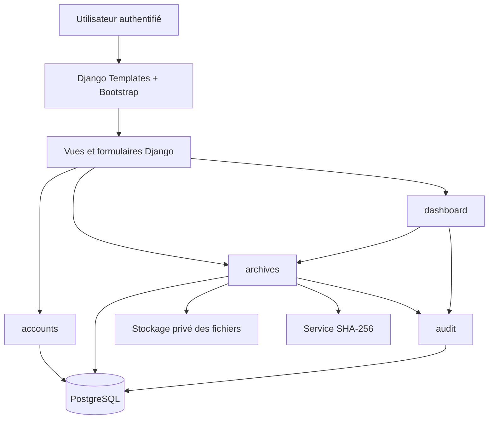
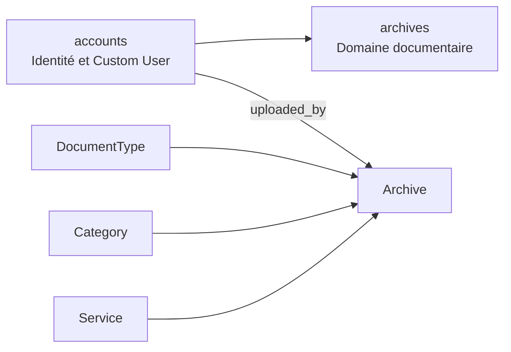

# Architecture cible

## Principes directeurs

L’architecture retenue est un **monolithe modulaire Django**. Elle privilégie la simplicité de déploiement, la lisibilité pour un projet de mémoire et la séparation des responsabilités. Elle évite volontairement un frontend indépendant, des microservices ou des composants distribués qui ne répondent pas au besoin du MVP.

| Couche | Responsabilité | Technologie initiale |
|---|---|---|
| Présentation | Pages, formulaires, messages, navigation responsive | Django Templates, Bootstrap |
| Application | Vues, formulaires, services métier et contrôles d’accès | Django |
| Domaine / persistance | Entités, contraintes, permissions et requêtes | ORM Django, PostgreSQL |
| Fichiers | Stockage privé, validation, empreinte et téléchargement contrôlé | `FileField`, stockage local en développement |
| Traçabilité | Journal immuable des opérations sensibles | Application `audit` |

## Découpage par applications Django

| Application | Responsabilités prévues | Dépendances principales |
|---|---|---|
| `config` | Paramètres, routes racines, configuration par environnement | Toutes les applications |
| `accounts` | Modèle `User`, rôles, administration et authentification | Auth Django |
| `archives` | Modèles métier, formulaires, CRUD, recherche, fichiers privés | `accounts`, `audit` |
| `audit` | Modèle `AuditLog`, service de journalisation et consultation | `accounts`, `archives` |
| `dashboard` | Indicateurs et dernières activités accessibles selon le rôle | `archives`, `audit`, `accounts` |

Les dépendances doivent rester orientées vers les applications métier. En particulier, `audit` ne doit pas contenir la logique de création ou de modification d’une archive ; il reçoit et conserve les événements produits par les opérations autorisées.

## Diagramme de composants

## Flux fonctionnels critiques

### Dépôt d’une archive

1. L’utilisateur authentifié soumet un formulaire comprenant le fichier et les métadonnées.
2. La vue vérifie la permission serveur et délègue la validation au formulaire ou au service dédié.
3. Le système contrôle le nom, l’extension, la taille et, lorsque possible, le type MIME du fichier.
4. Le fichier est enregistré dans un emplacement non exposé directement par une URL publique.
5. L’application calcule l’empreinte SHA-256, persiste l’archive dans une transaction et crée une ligne `AuditLog`.
6. Une confirmation est affichée sans divulguer de chemin de stockage interne.

### Consultation et téléchargement

Les fichiers ne seront pas servis directement depuis `MEDIA_URL` en production. Une vue applicative identifiera l’archive, vérifiera le droit de l’utilisateur et retournera le contenu uniquement si l’accès est accordé. La consultation et le téléchargement seront journalisés.

### Suppression ou désactivation

La suppression relèvera exclusivement du rôle Administrateur. La décision entre suppression logique et suppression physique sera documentée pendant T-008, après validation du besoin de conservation avec C-Tech. L’événement devra toujours être journalisé.

## Configuration par environnement

Les paramètres secrets sont lus depuis les variables d’environnement. Le dépôt contient uniquement `.env.example`, sans valeur réelle. Les réglages de sécurité de production, tels que `DEBUG=False`, les cookies sécurisés et les hôtes autorisés, seront activés dans une configuration de production distincte avant le déploiement.

## Évolutivité contrôlée

Le modèle prévoit des points d’extension pour les règles de confidentialité, les catégories, les types de document et les services. Les processus de conservation documentaire, les droits par service et les éventuelles règles réglementaires doivent toutefois être validés par C-Tech avant d’être considérés comme définitifs.

## Fondation d’identité — T-003

L’application `accounts` fournit le modèle `accounts.User` et constitue la seule source d’identité applicative. Les futures applications métier ne doivent ni importer `auth.User` ni définir de relation figée vers cette table ; elles utiliseront `settings.AUTH_USER_MODEL` dans leurs modèles et `get_user_model()` dans les services qui exigent la classe effective.

Le rôle métier stocké sur l’utilisateur permet d’orienter les règles fonctionnelles de haut niveau. Les groupes et permissions Django restent toutefois la source de vérité pour les autorisations précises, vérifiées côté serveur. Cette séparation empêche qu’un libellé métier tel qu’Administrateur entraîne implicitement des privilèges techniques globaux.

## Domaine documentaire — T-004

L’application `accounts` porte l’identité et le modèle utilisateur personnalisé. L’application `archives` porte le domaine documentaire : référentiels de service, catégorie et type de document, puis modèle central `Archive`. Sa relation `uploaded_by` cible `settings.AUTH_USER_MODEL`, ce qui maintient la compatibilité avec l’identité personnalisée introduite au ticket T-003.

T-004 n’ajoute aucune vue métier, aucun upload, aucune recherche, aucune règle RBAC d’archive ni journal d’audit. Ces comportements dépendront des modèles désormais disponibles mais restent explicitement hors périmètre du ticket.
