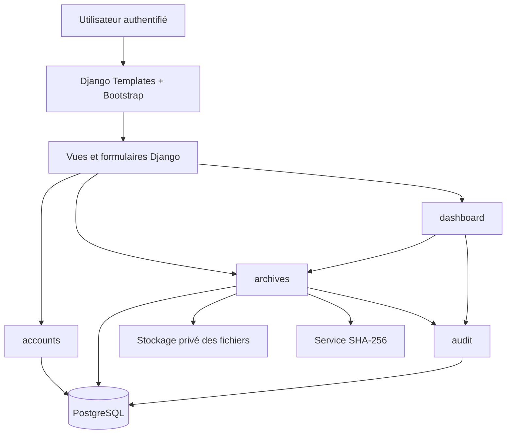
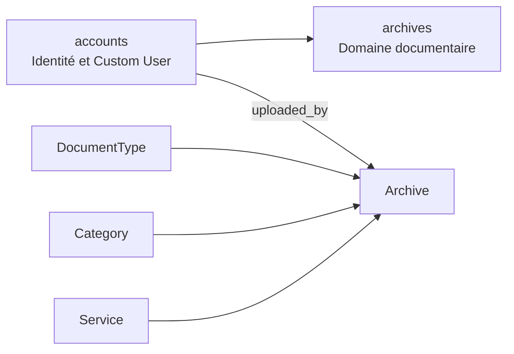
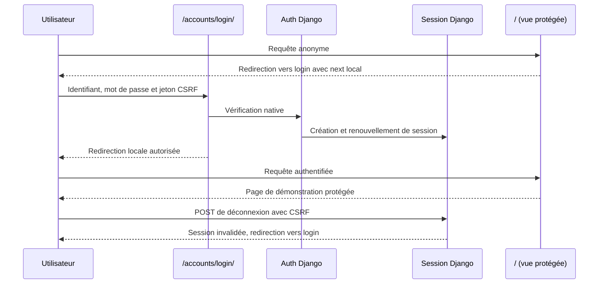
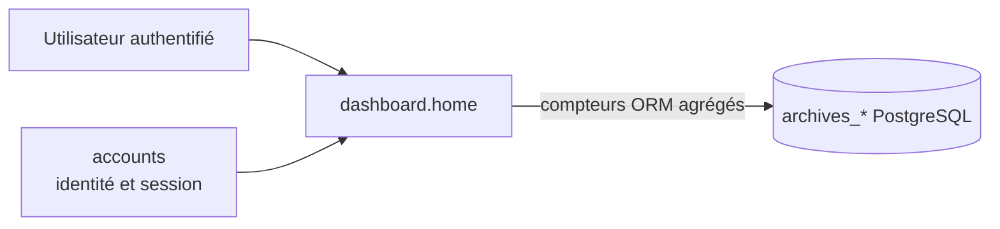
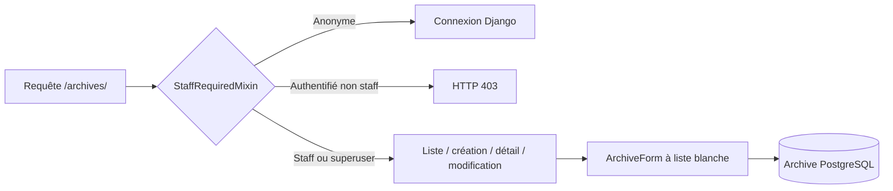
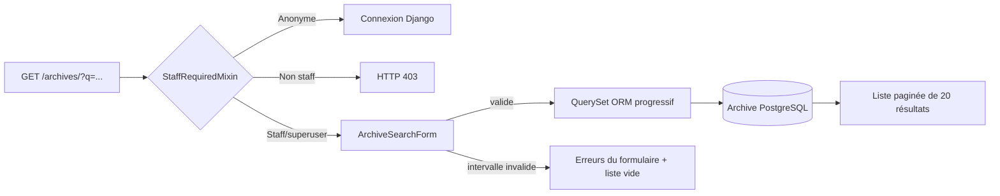
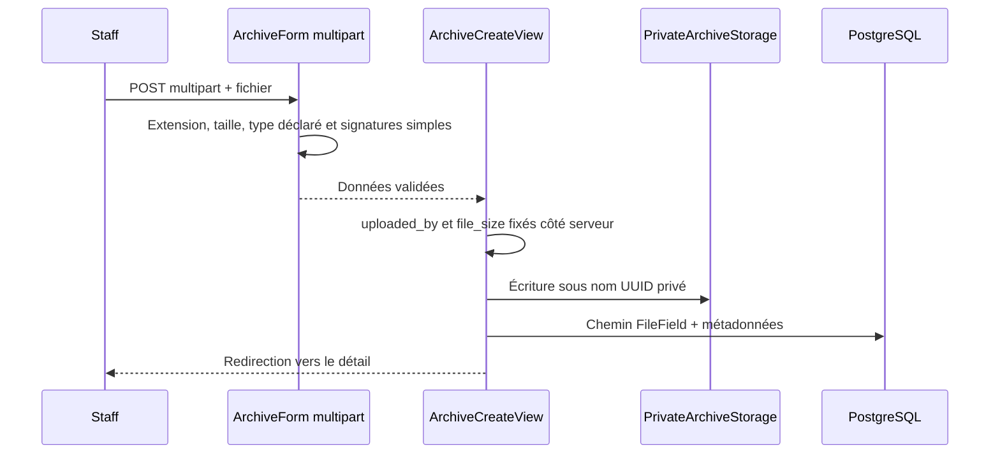
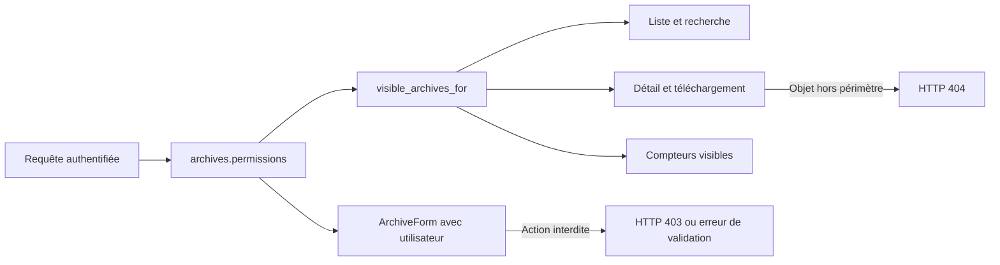
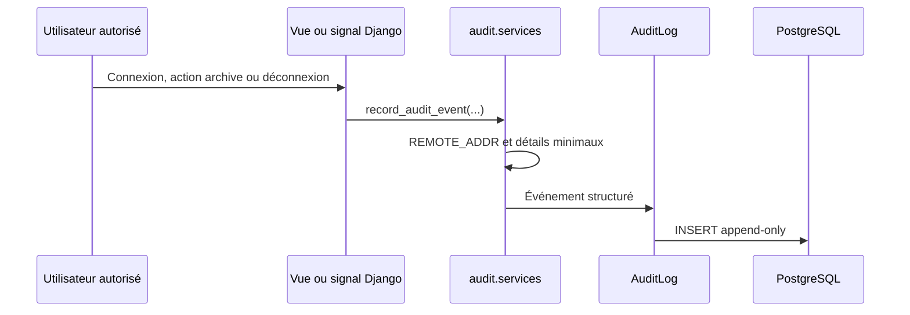

# Architecture cible

## Principes directeurs

L’architecture retenue est un **monolithe modulaire Django**. Elle privilégie la simplicité de déploiement, la lisibilité pour un projet de mémoire et la séparation des responsabilités. Elle évite volontairement un frontend indépendant, des microservices ou des composants distribués qui ne répondent pas au besoin du MVP.

| Couche | Responsabilité | Technologie initiale |
|---|---|---|
| Présentation | Pages, formulaires, messages, navigation responsive | Django Templates, Bootstrap |
| Application | Vues, formulaires, services métier et contrôles d’accès | Django |
| Domaine / persistance | Entités, contraintes, permissions et requêtes | ORM Django, PostgreSQL |
| Fichiers | Stockage privé, validation, empreinte et téléchargement contrôlé | `FileField`, stockage local en développement |
| Traçabilité | Journal immuable des opérations sensibles | Application `audit` |

## Découpage par applications Django

| Application | Responsabilités prévues | Dépendances principales |
|---|---|---|
| `config` | Paramètres, routes racines, configuration par environnement | Toutes les applications |
| `accounts` | Modèle `User`, rôles, administration et authentification | Auth Django |
| `archives` | Modèles métier, formulaires, CRUD, recherche, fichiers privés | `accounts`, `audit` |
| `audit` | Modèle `AuditLog`, service de journalisation et consultation | `accounts`, `archives` |
| `dashboard` | Indicateurs et dernières activités accessibles selon le rôle | `archives`, `audit`, `accounts` |

Les dépendances doivent rester orientées vers les applications métier. En particulier, `audit` ne doit pas contenir la logique de création ou de modification d’une archive ; il reçoit et conserve les événements produits par les opérations autorisées.

## Diagramme de composants

## Flux fonctionnels critiques

### Dépôt d’une archive

1. L’utilisateur authentifié soumet un formulaire comprenant le fichier et les métadonnées.
2. La vue vérifie la permission serveur et délègue la validation au formulaire ou au service dédié.
3. Le système contrôle le nom, l’extension, la taille et, lorsque possible, le type MIME du fichier.
4. Le fichier est enregistré dans un emplacement non exposé directement par une URL publique.
5. L’application calcule l’empreinte SHA-256, persiste l’archive dans une transaction et crée une ligne `AuditLog`.
6. Une confirmation est affichée sans divulguer de chemin de stockage interne.

### Consultation et téléchargement

Les fichiers ne seront pas servis directement depuis `MEDIA_URL` en production. Une vue applicative identifiera l’archive, vérifiera le droit de l’utilisateur et retournera le contenu uniquement si l’accès est accordé. La consultation et le téléchargement seront journalisés.

### Suppression ou désactivation

La suppression relèvera exclusivement du rôle Administrateur. La décision entre suppression logique et suppression physique sera documentée pendant T-008, après validation du besoin de conservation avec C-Tech. L’événement devra toujours être journalisé.

## Configuration par environnement

Les paramètres secrets sont lus depuis les variables d’environnement. Le dépôt contient uniquement `.env.example`, sans valeur réelle. Les réglages de sécurité de production, tels que `DEBUG=False`, les cookies sécurisés et les hôtes autorisés, seront activés dans une configuration de production distincte avant le déploiement.

## Évolutivité contrôlée

Le modèle prévoit des points d’extension pour les règles de confidentialité, les catégories, les types de document et les services. Les processus de conservation documentaire, les droits par service et les éventuelles règles réglementaires doivent toutefois être validés par C-Tech avant d’être considérés comme définitifs.

## Fondation d’identité — T-003

L’application `accounts` fournit le modèle `accounts.User` et constitue la seule source d’identité applicative. Les futures applications métier ne doivent ni importer `auth.User` ni définir de relation figée vers cette table ; elles utiliseront `settings.AUTH_USER_MODEL` dans leurs modèles et `get_user_model()` dans les services qui exigent la classe effective.

Le rôle métier stocké sur l’utilisateur permet d’orienter les règles fonctionnelles de haut niveau. Les groupes et permissions Django restent toutefois la source de vérité pour les autorisations précises, vérifiées côté serveur. Cette séparation empêche qu’un libellé métier tel qu’Administrateur entraîne implicitement des privilèges techniques globaux.

## Domaine documentaire — T-004

L’application `accounts` porte l’identité et le modèle utilisateur personnalisé. L’application `archives` porte le domaine documentaire : référentiels de service, catégorie et type de document, puis modèle central `Archive`. Sa relation `uploaded_by` cible `settings.AUTH_USER_MODEL`, ce qui maintient la compatibilité avec l’identité personnalisée introduite au ticket T-003.

T-004 n’ajoute aucune vue métier, aucun upload, aucune recherche, aucune règle RBAC d’archive ni journal d’audit. Ces comportements dépendront des modèles désormais disponibles mais restent explicitement hors périmètre du ticket.

## Flux d’authentification — T-006

Les vues d’archives, les permissions métier et le tableau de bord complet ne sont pas introduits par ce flux. La page racine sert uniquement de preuve contrôlée que l’authentification par session est active avant les travaux du ticket T-007.

## Tableau de bord de synthèse — T-007

L’application `dashboard` devient responsable de la synthèse authentifiée. `accounts` conserve l’identité et l’authentification ; `archives` reste propriétaire des données documentaires. La page racine est protégée par `@login_required` et ne présente ni création, ni modification, ni suppression, ni recherche d’archives.

Les six indicateurs sont calculés à partir de requêtes ORM lisibles sur les tables d’archives et de référentiels. Aucune archive individuelle, relation documentaire ou métadonnée associée n’est renvoyée par la vue. Cette décision évite qu’un utilisateur authentifié voie une référence, un titre, un service ou une catégorie confidentiels avant que T-011 n’ait défini la politique d’autorisation complète.

À l’étape historique T-007, le dashboard n’affichait aucune activité récente car le modèle d’audit et le RBAC documentaire n’étaient pas encore intégrés. Dans l’état final, l’audit existe et le dashboard conserve volontairement six agrégats limités au périmètre visible ; il n’expose ni checksum, ni donnée de mot de passe, ni liste individuelle de documents.

## Gestion contrôlée des métadonnées — T-008

L’application `archives` fournit désormais les vues de liste, création, détail et modification des métadonnées. Les routes sont regroupées sous le namespace `/archives/`. La liste est paginée à vingt éléments et ordonnée par `-created_at`; ses relations sont préchargées avec `select_related` afin d’éviter un accès relationnel N+1 pendant le rendu.

À l’étape historique T-008, le contrôle d’accès passait temporairement par `StaffRequiredMixin`. Dans l’état final, T-011 a remplacé cette garde par la politique métier centralisée `archives.permissions`, appliquée avant les listes, recherches, paginations, détails, téléchargements, formulaires et agrégats. La description actuelle est disponible dans [`architecture-final.md`](architecture-final.md) et [`final-rbac-matrix.md`](final-rbac-matrix.md).

`ArchiveForm` n’expose que les métadonnées métier modifiables. Le champ `uploaded_by` est fixé côté serveur lors de la création et les champs `file_size`, `checksum`, `created_at` et `updated_at` restent hors formulaire. La suppression physique, le téléversement, la recherche et le contrôle métier de confidentialité ne sont pas introduits dans cette étape.

## Recherche et filtres de métadonnées — T-009

La route de liste `/archives/` devient le point d’entrée unique de la recherche. Elle conserve la garde transitoire `StaffRequiredMixin` de T-008 : les requêtes anonymes sont redirigées vers la connexion et les comptes authentifiés non staff reçoivent une réponse HTTP 403. La règle métier par rôle, par service ou par niveau de confidentialité n’est pas introduite ; elle reste réservée à T-011.

`ArchiveSearchForm` est un formulaire GET à champs facultatifs. Il accepte une recherche textuelle sur `reference`, `title` et `description`, puis des filtres combinables sur `category`, `document_type`, `service`, `status`, `confidentiality_level`, `document_date_from` et `document_date_to`. Les listes de référentiels présentent les entrées actives et les entrées historiques déjà associées à une archive, afin qu’une archive existante ne devienne pas introuvable après désactivation d’un référentiel.

La vue construit un `QuerySet` Django incrémental. Elle charge les relations rendues par le tableau avec `select_related`, combine les trois champs textuels par objets `Q`, applique les filtres structurés seulement lorsqu’ils sont fournis et impose l’ordre déterministe `-created_at`, `-pk`. La pagination reste fixée à vingt résultats ; la query string sans le paramètre `page` est transmise au gabarit afin de conserver tous les critères entre les pages.

Cette étape ne crée aucune migration et n’ajoute ni recherche PostgreSQL plein texte, ni `tsvector`, ni Elasticsearch, ni embeddings, ni recherche sémantique. Elle ne modifie ni le modèle `Archive`, ni la politique de conservation, ni la journalisation d’audit, ni les règles RBAC métier futures.

## Téléversement et téléchargement privés — T-010

T-010 ajoute un `FileField` facultatif à `Archive`, sans placer le contenu binaire dans PostgreSQL. Le chemin relatif est enregistré dans la table d’archives, alors que Django Storage écrit le fichier sous `PRIVATE_MEDIA_ROOT`. La fonction `archive_private_upload_to` remplace le nom et le chemin soumis par le navigateur par `archives/<uuid>.<extension>` ; deux noms clients identiques ne peuvent donc pas écraser le même fichier physique.

La validation combine une allowlist d’extensions configurable, une taille maximale configurable, le refus des fichiers vides, le type de contenu déclaré lorsqu’il est disponible et une vérification de signature pour PDF, PNG et JPEG. Les formats Office et texte ne font l’objet d’aucune prétention d’analyse de contenu exhaustive. Ces contrôles réduisent le risque, mais ne remplacent ni un antivirus ni une politique de filtrage de contenu spécialisée.

Le téléchargement est distinct du stockage. La route `/archives/<pk>/download/` passe par `ArchiveDownloadView`, conserve `StaffRequiredMixin`, vérifie l’existence du fichier puis renvoie `FileResponse` avec `as_attachment=True`. Les gabarits ne construisent aucune URL à partir de `archive.file.url`; ils pointent exclusivement vers cette route applicative. Une archive sans fichier, une archive inconnue ou un fichier disparu du stockage obtient une réponse 404 sans suppression silencieuse des métadonnées.

La modification des métadonnées retire volontairement le champ `file` du formulaire d’édition. Le remplacement d’un contenu documentaire est donc exclu tant que C-Tech n’a pas validé une politique de versioning, de conservation et de traçabilité.

## Autorisation RBAC et confidentialité — T-011

T-011 remplace la garde technique `StaffRequiredMixin` par une politique métier centralisée dans `archives.permissions`. Cette couche associe les rôles métier aux niveaux de confidentialité visibles, construit le QuerySet autorisé avec `visible_archives_for`, décide les droits de création et de modification, puis sert de référence unique aux mixins, formulaires, vues, navigation et dashboard. Un superuser Django reçoit un accès technique complet ; ce statut reste distinct du rôle métier `ADMINISTRATEUR`.

| Rôle | PUBLIC | INTERNAL | CONFIDENTIAL | Création / modification |
|---|---|---|---|---|
| Administrateur | Lecture / écriture | Lecture / écriture | Lecture / écriture | Toutes les confidences |
| Agent d’archives | Lecture / écriture | Lecture / écriture | Aucun accès | PUBLIC et INTERNAL seulement |
| Consultant | Lecture | Aucun accès | Aucun accès | Aucune |

La liste construit d’abord le QuerySet autorisé, puis applique la recherche textuelle, les filtres et la pagination. Cette séquence évite qu’un terme recherché, un compteur de résultats ou une pagination révèle l’existence d’une archive hors périmètre. Les choix de référentiels dans la recherche sont également dérivés des seules archives visibles.

Les vues de détail et de téléchargement réutilisent le même filtrage ; une archive existante mais invisible retourne HTTP 404 afin de ne pas confirmer son existence. À l’inverse, une archive PUBLIC visible mais qu’un Consultant tente de modifier retourne HTTP 403 : son existence est déjà connue, mais l’action est interdite. Le dashboard calcule ses agrégats et ses référentiels actifs à partir du même périmètre visible.

La matrice reste provisoire : aucune ACL par service, attribution nominative, règle de partage ou logique d’audit n’est introduite dans cette étape. Ces axes restent à valider avec C-Tech.

## Journal d’audit métier append-only — T-012

L’application transverse `audit` porte le modèle `AuditLog`, afin que la traçabilité ne soit pas confondue avec le domaine documentaire. Chaque événement contient l’acteur et son identifiant de lecture, une action centralisée, une archive optionnelle et sa référence, un horodatage serveur, une adresse IP nullable et des détails JSON minimaux. Les relations vers l’utilisateur et l’archive utilisent `PROTECT` afin qu’une suppression future ne détruise pas l’historique.

`record_audit_event` est l’unique API d’écriture applicative. Elle accepte seulement les actions réellement disponibles : `LOGIN`, `LOGOUT`, `ARCHIVE_CREATE`, `ARCHIVE_UPDATE`, `ARCHIVE_VIEW` et `ARCHIVE_DOWNLOAD`. Les détails sont réduits à `source` et `changed_fields` ; les valeurs de formulaire, mots de passe, hashes, sessions, contenus de fichier et chemins de stockage ne sont jamais recopiés.

Les événements de connexion et déconnexion utilisent les signaux Django `user_logged_in` et `user_logged_out`. Les actions d’archive sont intégrées explicitement après la réussite des vues : création et modification dans une transaction avec l’archive, consultation après obtention d’un objet autorisé, téléchargement après validation de l’accès et ouverture effective du fichier. Les listes et recherches ne génèrent aucun événement de consultation afin d’éviter le bruit.

La consultation métier `/audit/` est paginée, triée par `-timestamp, -pk` et réservée à l’Administrateur métier ou au superuser technique. L’administration Django est également en lecture seule. Cette append-only policy est applicative : elle ne prétend pas fournir une immutabilité cryptographique ou un stockage externe inviolable.

## Contrôle d’intégrité SHA-256 — T-013

Le module `archives.integrity` centralise tout calcul d’empreinte. `calculate_sha256` utilise `hashlib.sha256()` et lit les flux par blocs de 64 KiB, ce qui borne la mémoire supplémentaire utilisée indépendamment de la taille du fichier. Lorsqu’un flux le permet, sa position initiale est restaurée après calcul pour ne pas perturber une opération suivante de stockage ou de téléchargement.

Après une création d’archive avec fichier, la vue persiste d’abord le document dans le stockage privé puis calcule `calculate_archive_checksum` sur ce fichier réellement stocké. L’empreinte obtenue est écrite dans le champ `Archive.checksum` existant ; aucune valeur de checksum venue du client n’est utilisée. La création d’archive et l’écriture du checksum restent dans le même flux transactionnel PostgreSQL, mais le stockage de fichiers et la base ne constituent pas une transaction distribuée parfaite : un échec tardif peut théoriquement laisser un fichier orphelin à traiter opérationnellement.

`verify_archive_integrity` ne modifie jamais le checksum historique et retourne un état explicite : `VALID`, `MISMATCH`, `NO_FILE`, `MISSING_CHECKSUM`, `FILE_MISSING` ou `ERROR`. La vérification est déclenchée seulement par `POST /archives/<pk>/verify-integrity/`, avec CSRF et le même QuerySet visible que les vues de détail et téléchargement. Elle est disponible à tout rôle pouvant consulter l’archive ; un objet hors périmètre reste HTTP 404.

La vérification crée l’événement d’audit `ARCHIVE_INTEGRITY_CHECK` avec le seul détail `result`. Les empreintes attendue ou calculée ne sont pas dupliquées dans l’audit. Aucun recalcul n’est effectué automatiquement lors des listes, recherches, dashboards ou téléchargements, car cette opération est proportionnelle à la taille du fichier et doit rester explicite dans le MVP.

## Revue de sécurité et durcissement — T-014

T-014 ne modifie pas l’architecture fonctionnelle du MVP. Il vérifie la défense en profondeur déjà en place : authentification par session, politique RBAC centralisée, filtrage du QuerySet avant les objets, formulaires à liste blanche, stockage privé, audit applicatif minimal et contrôle d’intégrité à la demande. La matrice `tests/test_security_hardening.py` exerce ces contrôles de manière transversale plutôt que d’ajouter un nouveau mécanisme métier.

Les routes contenant un identifiant d’archive appliquent le même périmètre visible que les listes. Ainsi, détail, édition, téléchargement et vérification SHA-256 répondent 404 lorsqu’un objet est hors périmètre ; l’édition d’un objet visible mais non modifiable répond 403. Le stockage privé n’est relié à aucune route `MEDIA_URL` et les téléchargements passent par `FileResponse` après contrôle applicatif.

Les paramètres de production sont lus depuis l’environnement. Le développement conserve HTTP et `DEBUG` pour faciliter le travail local, tandis que la production exige explicitement secret, hôtes, HTTPS, cookies secure et HSTS. Cette séparation est vérifiée par `check --deploy` et documentée dans [`security-review.md`](security-review.md).

## Interface finale responsive — T-015

T-015 conserve l’architecture **server-rendered** du MVP : les vues Django continuent de préparer les données, les formulaires restent des `Form`/`ModelForm` Django, et les gabarits rendent l’interface à partir de ce contexte. La feuille `static/css/app.css` constitue la couche de présentation partagée ; elle centralise palette, typographie, espacements, composants, règles responsive et focus visible. Aucun framework frontend, aucune dépendance CDN critique et aucun backend API n’ont été ajoutés.

La navigation visible exploite exclusivement les indicateurs de contexte `archive_policy` et `audit_policy`, eux-mêmes dérivés des règles existantes. Cette adaptation ergonomique ne remplace pas les contrôles de `archives.permissions`, des QuerySets, mixins et vues. Les routes, méthodes HTTP, contrôles CSRF, audit, stockage privé et intégrité SHA-256 ne sont pas modifiés par la refonte.

Les gabarits couvrent le login, le dashboard, la liste et la recherche d’archives, la fiche, le formulaire, l’audit ainsi que les pages 403/404/500. Les tables deviennent défilables horizontalement sur petit écran, tandis que la sidebar est convertie en navigation compacte. Cette amélioration d’interface ne requiert aucune migration de base de données.
