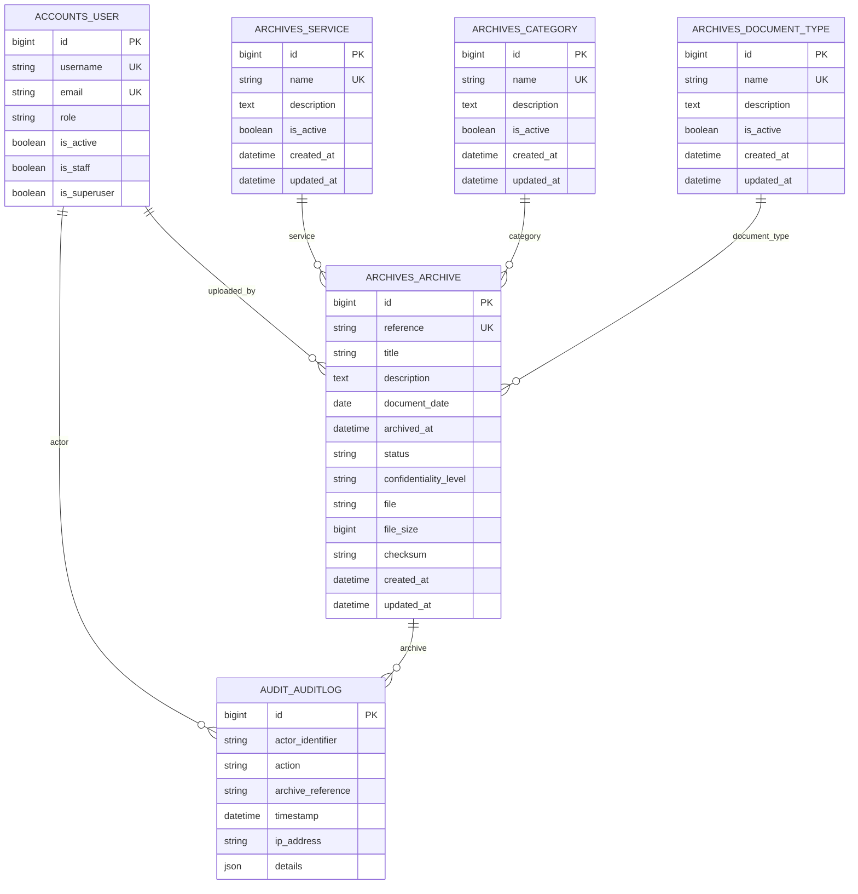

# Modèle de données appliqué

## Principes de modélisation

Le schéma sépare les **référentiels documentaires** (`Service`, `Category`, `DocumentType`) de l’entité centrale `Archive`. Les référentiels possèdent un état `is_active` afin de pouvoir être désactivés sans effacer l’historique. Les valeurs métier, les statuts et les niveaux de confidentialité restent provisoires tant que C-Tech ne les a pas validés ; elles sont consignées dans [`assumptions.md`](assumptions.md).

Le projet utilise `accounts.User` comme modèle utilisateur personnalisé. Toutes les relations futures vers un utilisateur devront utiliser `settings.AUTH_USER_MODEL`. Les clés primaires sont techniques et les dates de création ou de mise à jour sont gérées par Django.

## Modèles réellement créés

| Modèle | Champs structurants | Contraintes et rôle |
|---|---|---|
| `accounts.User` | `username`, `email`, `role`, indicateurs Django, dates d’identité | `username` et `email` uniques ; trois rôles métier ; modèle actif via `AUTH_USER_MODEL` |
| `Service` | `name`, `description`, `is_active`, `created_at`, `updated_at` | Nom unique ; référentiel organisationnel conservé lorsqu’il devient inactif |
| `Category` | `name`, `description`, `is_active`, `created_at`, `updated_at` | Nom unique ; classement documentaire général |
| `DocumentType` | `name`, `description`, `is_active`, `created_at`, `updated_at` | Nom unique ; qualification documentaire précise, distincte de la catégorie |
| `Archive` | `reference`, `title`, `description`, relations, dates, `status`, `confidentiality_level`, `file`, `file_size`, `checksum`, timestamps | Référence unique ; chemin de document privé, contrôles de valeurs et de taille ; contenu binaire hors PostgreSQL |
| `AuditLog` | `actor`, `actor_identifier`, `action`, `archive`, `archive_reference`, `timestamp`, `ip_address`, `details` | Événement métier append-only ; relations protégées, snapshots lisibles et détails JSON minimaux |

> Une **catégorie** classe largement un document, par exemple « Contrat ». Un **type de document** le qualifie plus précisément, par exemple « Contrat de prestation ». Cette distinction est une hypothèse contrôlée, non une hiérarchie ou une politique définitive C-Tech.

## MCD appliqué

## MLD textuel

| Table | Attributs principaux | Clés, relations et intégrité |
|---|---|---|
| `accounts_user` | Champs hérités d’`AbstractUser`, `email`, `role` | PK `id` ; UK `username` et `email` ; contrainte `accounts_user_role_is_valid` |
| `archives_service` | `id`, `name`, `description`, `is_active`, `created_at`, `updated_at` | PK `id` ; UK `name` |
| `archives_category` | `id`, `name`, `description`, `is_active`, `created_at`, `updated_at` | PK `id` ; UK `name` |
| `archives_documenttype` | `id`, `name`, `description`, `is_active`, `created_at`, `updated_at` | PK `id` ; UK `name` |
| `archives_archive` | `id`, `reference`, `title`, `description`, `category_id`, `document_type_id`, `service_id`, `uploaded_by_id`, `document_date`, `archived_at`, `status`, `confidentiality_level`, `file`, `file_size`, `checksum`, `created_at`, `updated_at` | PK `id` ; UK `reference` ; quatre clés étrangères protégées ; le champ `file` conserve un chemin généré vers le stockage privé ; contraintes de statut, confidentialité, taille et checksum |
| `audit_auditlog` | `id`, `actor_id`, `actor_identifier`, `action`, `archive_id`, `archive_reference`, `timestamp`, `ip_address`, `details` | PK `id` ; `actor_id` obligatoire en `PROTECT` ; `archive_id` nullable en `PROTECT` ; ordre stable par `-timestamp`, `-pk` |

## Relations et politique `on_delete`

| Relation depuis `Archive` | Comportement | Justification |
|---|---|---|
| `service` → `Service` | `PROTECT` | Empêche qu’une suppression de service efface ou orpheline les archives déjà rattachées. Un service devenu obsolète est désactivé via `is_active`. |
| `category` → `Category` | `PROTECT` | Préserve la capacité à comprendre le classement historique des archives. |
| `document_type` → `DocumentType` | `PROTECT` | Préserve la qualification documentaire historique. |
| `uploaded_by` → `settings.AUTH_USER_MODEL` | `PROTECT` | Préserve la traçabilité de l’utilisateur ayant ajouté l’archive. Les comptes doivent être désactivés, non supprimés, lorsqu’ils sont référencés. |

`CASCADE` n’est pas utilisé car il pourrait supprimer massivement des archives à la suite de la suppression d’un référentiel ou d’un utilisateur. `SET_NULL` n’est pas retenu dans T-004, car il détruirait l’information de rattachement historique. Ces choix pourront être réévalués seulement après validation de la politique de conservation par C-Tech.

T-012 applique également `PROTECT` entre `AuditLog` et son acteur, ainsi qu’entre `AuditLog` et son archive lorsqu’elle est concernée. Les snapshots `actor_identifier` et `archive_reference` gardent une lecture immédiate de l’événement. `details` est un JSON minimal limité à `source` et, pour une modification, `changed_fields` ; il ne reçoit ni mot de passe, ni hash, ni session, ni contenu ou chemin privé de fichier.

## Statuts, confidentialité et métadonnées provisoires

`Archive.status` accepte `ACTIVE` ou `ARCHIVED`. `Archive.confidentiality_level` accepte `PUBLIC`, `INTERNAL` ou `CONFIDENTIAL`. Les deux champs utilisent `TextChoices` et des contraintes PostgreSQL dédiées, mais ne déclenchent encore aucune règle d’autorisation.

`document_date` est la date portée par le document lui-même ; elle peut être inconnue. `archived_at` est la date à laquelle le document est officiellement placé dans le système d’archives ; elle peut également être renseignée dans un ticket ultérieur lorsque le workflow exact sera validé. `created_at` et `updated_at` décrivent les opérations de persistance de l’enregistrement applicatif.

`file` est un `FileField` Django ajouté par la migration `archives.0002_archive_file`. La table PostgreSQL conserve uniquement son chemin relatif généré par le serveur ; le contenu reste dans un stockage privé administré par l’abstraction Django Storage. Le champ est temporairement vide pour les archives historiques, mais la création fonctionnelle peut désormais joindre un document.

`file_size` est stocké en octets et doit être supérieur ou égal à zéro. Lors d’un upload, il est fixé côté serveur à partir du fichier réel et non d’une valeur POST. `checksum` est soit vide, soit une empreinte SHA-256 hexadécimale de 64 caractères. T-013 calcule cette empreinte par blocs de 64 KiB après le stockage du fichier et l’enregistre comme référence historique ; aucune valeur cliente ne peut la fournir. Une archive historique sans fichier conserve `checksum=""` et une archive antérieure avec fichier mais sans empreinte est distinguée comme `MISSING_CHECKSUM` lors d’une vérification.

La somme de contrôle sert exclusivement au contrôle d’**intégrité** : le fichier actuellement stocké est relu et comparé à l’empreinte de référence, sans jamais remplacer cette référence en cas de `MISMATCH`. Elle n’est ni du chiffrement, ni une signature électronique, ni un contrôle d’accès, ni un antivirus. Aucun champ `Archive` supplémentaire ni aucune migration du domaine archive n’est requis pour T-013.

## Index et contraintes

La contrainte d’unicité de `reference` crée déjà un index. Django crée également les index nécessaires aux clés étrangères. Le seul index explicite de T-004 est `archives_status_date_idx` sur (`status`, `document_date`), car les futures listes d’archives pourront filtrer les documents actifs ou archivés par date. Aucun index textuel ou index supplémentaire n’est anticipé sans usage démontré.

Les contraintes PostgreSQL `archives_archive_status_is_valid`, `archives_archive_confidentiality_is_valid`, `archives_archive_file_size_nonnegative` et `archives_archive_checksum_is_sha256_or_empty` complètent la validation Django. `full_clean()` valide au niveau applicatif lorsqu’il est explicitement appelé ; `save()` ne l’appelle pas automatiquement. Les contraintes de base protègent donc aussi contre des écritures qui contourneraient la validation applicative.
