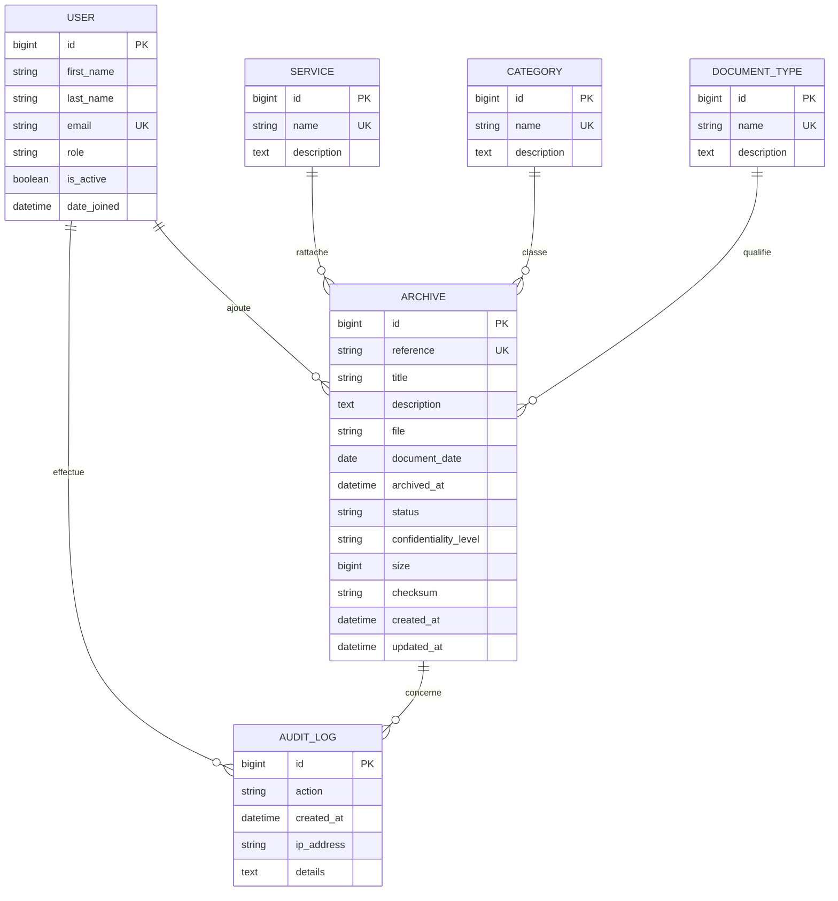

# Modèle de données

## Principes de modélisation

Le modèle sépare les référentiels (`Service`, `Category`, `DocumentType`) de l’entité centrale `Archive`. Les champs obligatoires finaux, les statuts autorisés et la politique de conservation devront être confirmés avec C-Tech ; ils ne sont donc pas figés au-delà du MVP.

Les clés primaires seront des identifiants techniques. Les dates de création et de mise à jour seront gérées par Django. Les relations sont déclarées dans l’ORM afin de préserver l’intégrité référentielle sans SQL construit manuellement.

## Modèles Django proposés

| Modèle | Champs principaux | Contraintes métier initiales |
|---|---|---|
| `User` | `first_name`, `last_name`, `email`, `role`, `is_active`, `date_joined` | Étend `AbstractUser`; email unique; rôle contrôlé par choix applicatif |
| `Service` | `name`, `description` | Nom unique recommandé |
| `Category` | `name`, `description` | Nom unique recommandé |
| `DocumentType` | `name`, `description` | Nom unique recommandé |
| `Archive` | `reference`, `title`, `description`, `file`, `category`, `document_type`, `service`, `uploaded_by`, `document_date`, `archived_at`, `status`, `confidentiality_level`, `size`, `checksum`, `created_at`, `updated_at` | Référence unique; empreinte SHA-256; fichier privé; relations obligatoires à confirmer |
| `AuditLog` | `user`, `action`, `archive`, `created_at`, `ip_address`, `details` | Événement daté; archive nullable pour les actions d’authentification |

Les choix de rôle initiaux sont `ADMINISTRATEUR`, `AGENT_ARCHIVES` et `CONSULTANT`. Les valeurs exactes de `status` et de `confidentiality_level` ne doivent être ajoutées qu’après validation avec C-Tech. Une proposition de départ est de distinguer les statuts `ACTIF`, `ARCHIVE`, `DESACTIVE` et les niveaux `PUBLIC_INTERNE`, `RESTREINT`, `CONFIDENTIEL`.

## MCD initial

## MLD initial

| Table | Attributs | Clés et relations |
|---|---|---|
| `accounts_user` | `id`, `first_name`, `last_name`, `email`, `role`, `is_active`, `date_joined`, champs d’authentification Django | PK `id`; UK `email` |
| `archives_service` | `id`, `name`, `description` | PK `id`; UK `name` |
| `archives_category` | `id`, `name`, `description` | PK `id`; UK `name` |
| `archives_documenttype` | `id`, `name`, `description` | PK `id`; UK `name` |
| `archives_archive` | `id`, `reference`, `title`, `description`, `file`, `category_id`, `document_type_id`, `service_id`, `uploaded_by_id`, `document_date`, `archived_at`, `status`, `confidentiality_level`, `size`, `checksum`, `created_at`, `updated_at` | PK `id`; UK `reference`; FK vers `category`, `document_type`, `service`, `user` |
| `audit_auditlog` | `id`, `user_id`, `action`, `archive_id`, `created_at`, `ip_address`, `details` | PK `id`; FK vers `user`; FK nullable vers `archive` |

## Index et intégrité

Les index à prévoir dans les premières migrations utiles concernent `Archive.reference`, les clés étrangères de l’archive, `Archive.document_date`, `Archive.status`, `Archive.confidentiality_level` et `AuditLog.created_at`. La recherche textuelle initiale peut combiner des filtres ORM sur la référence et le titre ; une indexation PostgreSQL plus avancée sera étudiée uniquement si le volume ou les besoins l’exigent.

La valeur `checksum` correspondra à une chaîne hexadécimale SHA-256 de 64 caractères. La taille devra être stockée en octets. La somme de contrôle est une propriété d’intégrité, non une méthode de chiffrement ni de contrôle d’accès.
