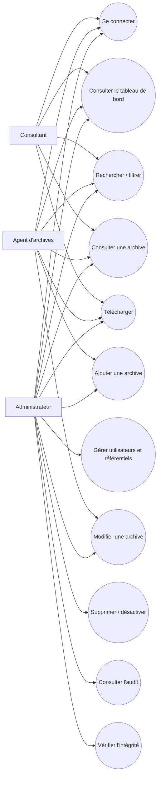

# Cas d’utilisation du MVP

## Acteurs

| Acteur | Description | Responsabilités principales |
|---|---|---|
| Administrateur | Utilisateur chargé de l’administration fonctionnelle et de la supervision | Utilisateurs, référentiels, archives, audit |
| Agent d’archives | Utilisateur opérationnel chargé de la gestion documentaire | Ajouter, rechercher, consulter et modifier certaines métadonnées |
| Consultant | Utilisateur en lecture contrôlée | Rechercher, consulter et télécharger les archives autorisées |
| Système | Application Django et ses services internes | Validation, autorisation, calcul d’empreinte, journalisation |

## Catalogue des cas d’utilisation

| Identifiant | Cas d’utilisation | Acteurs | Résultat attendu |
|---|---|---|---|
| UC-01 | Se connecter | Tous | Session sécurisée créée ; action `LOGIN` journalisée |
| UC-02 | Se déconnecter | Tous | Session terminée ; action `LOGOUT` journalisée |
| UC-03 | Consulter le tableau de bord | Tous selon droits | Indicateurs et activités visibles selon le rôle |
| UC-04 | Gérer les utilisateurs | Administrateur | Comptes créés, modifiés ou désactivés |
| UC-05 | Gérer les référentiels | Administrateur | Services, catégories et types de documents maintenus |
| UC-06 | Ajouter une archive | Administrateur, Agent d’archives | Fichier et métadonnées validés, archivés, signés par checksum et journalisés |
| UC-07 | Rechercher et filtrer les archives | Tous selon droits | Résultats limités aux archives accessibles |
| UC-08 | Consulter une archive | Tous selon droits | Métadonnées accessibles ; action `VIEW_ARCHIVE` journalisée |
| UC-09 | Télécharger un document | Tous selon droits | Fichier servi après contrôle ; action `DOWNLOAD_ARCHIVE` journalisée |
| UC-10 | Modifier une archive | Administrateur, Agent d’archives limité | Métadonnées mises à jour et action journalisée |
| UC-11 | Supprimer ou désactiver une archive | Administrateur | Archive traitée selon politique validée ; action `DELETE_ARCHIVE` journalisée |
| UC-12 | Consulter le journal d’audit | Administrateur | Liste filtrable des événements sensibles |
| UC-13 | Vérifier l’intégrité d’un fichier | Administrateur | Empreinte recalculée et résultat de comparaison affiché |

## Diagramme de cas d’utilisation initial

Les conditions précises d’autorisation du Consultant doivent être confirmées avec C-Tech. Elles conditionneront les contrôles fins du futur cas UC-07 à UC-09.
